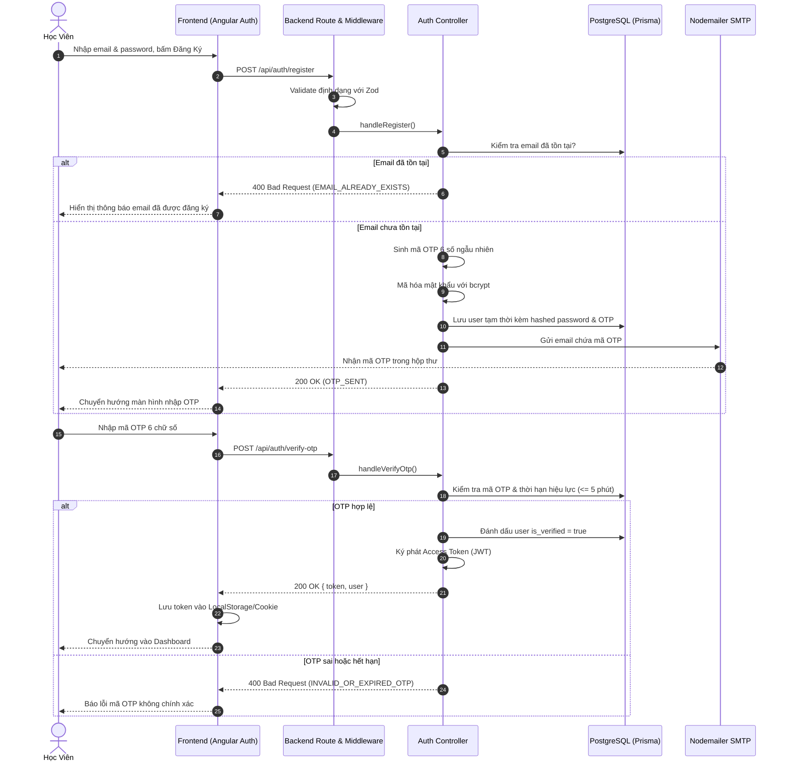

# FEAT-AUTH-001 - Sơ Đồ Luồng Hoạt Động (Data & Logic Flow)

```mermaid
sequenceDiagram
    autonumber
    actor User as Học Viên
    participant FE as Frontend (Angular Auth)
    participant API as Backend Route & Middleware
    participant Ctrl as Auth Controller
    participant DB as PostgreSQL (Prisma)
    participant Mail as Nodemailer SMTP

    User->>FE: Nhập email & password, bấm Đăng Ký
    FE->>API: POST /api/auth/register
    API->>API: Validate định dạng với Zod
    API->>Ctrl: handleRegister()
    Ctrl->>DB: Kiểm tra email đã tồn tại?
    alt Email đã tồn tại
        Ctrl-->>FE: 400 Bad Request (EMAIL_ALREADY_EXISTS)
        FE-->>User: Hiển thị thông báo email đã được đăng ký
    else Email chưa tồn tại
        Ctrl->>Ctrl: Sinh mã OTP 6 số ngẫu nhiên
        Ctrl->>Ctrl: Mã hóa mật khẩu với bcrypt
        Ctrl->>DB: Lưu user tạm thời kèm hashed password & OTP
        Ctrl->>Mail: Gửi email chứa mã OTP
        Mail-->>User: Nhận mã OTP trong hộp thư
        Ctrl-->>FE: 200 OK (OTP_SENT)
        FE-->>User: Chuyển hướng màn hình nhập OTP
    end

    User->>FE: Nhập mã OTP 6 chữ số
    FE->>API: POST /api/auth/verify-otp
    API->>Ctrl: handleVerifyOtp()
    Ctrl->>DB: Kiểm tra mã OTP & thời hạn hiệu lực (<= 5 phút)
    alt OTP hợp lệ
        Ctrl->>DB: Đánh dấu user is_verified = true
        Ctrl->>Ctrl: Ký phát Access Token (JWT)
        Ctrl-->>FE: 200 OK { token, user }
        FE->>FE: Lưu token vào LocalStorage/Cookie
        FE-->>User: Chuyển hướng vào Dashboard
    else OTP sai hoặc hết hạn
        Ctrl-->>FE: 400 Bad Request (INVALID_OR_EXPIRED_OTP)
        FE-->>User: Báo lỗi mã OTP không chính xác
    end
```
