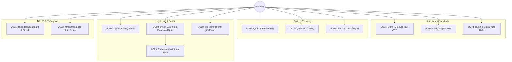

# TÀI LIỆU MÔ TẢ USE CASE FLOWS - HỆ THỐNG MEMOFIT

## 1. TỔNG QUAN HỆ THỐNG (SYSTEM OVERVIEW)
**Memofit** là ứng dụng hỗ trợ học từ vựng thông minh tích hợp thuật toán **Lặp lại ngắt quãng (SuperMemo-2 / SM-2)** và **Trí tuệ nhân tạo (AI)** tự động sinh câu hỏi. Hệ thống giúp người dùng tạo bộ từ vựng, luyện tập thẻ ghi nhớ (flashcard), thi trắc nghiệm/điền từ, tự động nhắc nhở lịch ôn tập và theo dõi chuỗi ngày học (Streak).

---

## 2. ACTORS & VAI TRÒ
- **Học viên (User / Learner):** Người dùng hệ thống, thực hiện tạo bộ từ vựng, luyện tập, làm bài kiểm tra, theo dõi tiến độ.
- **Hệ thống AI (AI Generator):** Thành phần tự động phân tích từ vựng và tự động tạo các dạng câu hỏi luyện tập (Trắc nghiệm, Điền từ cloze, Nghe gõ từ, ...).
- **Hệ thống SM-2 Engine:** Thành phần tính toán khoảng thời gian ôn tập tối ưu (Ease Factor, Repetitions, Interval Days, Next Review Date) dựa trên phản hồi của người dùng.
- **Hệ thống Email (SMTP Provider):** Gửi mã OTP xác nhận đăng ký và khôi phục mật khẩu.

---

## 3. SƠ ĐỒ TỔNG QUAN USE CASES (MERMAID)

---

## 4. CHI TIẾT FLOW CÁC USE CASE

### UC01: Đăng ký & Xác thực OTP Email
- **Mục đích:** Cho phép người dùng tạo tài khoản mới và xác thực địa chỉ email qua mã OTP 6 chữ số.
- **Tiền điều kiện (Pre-conditions):** Người dùng chưa đăng nhập, email chưa tồn tại trong hệ thống.
- **Hậu điều kiện (Post-conditions):** Tài khoản được tạo thành công, `isOtpVerify` = true.

#### Luồng chính (Main Flow):
1. Người dùng nhập thông tin: `Username`, `Email`, `Password`.
2. Hệ thống kiểm tra trùng lặp Email/Username.
3. Hệ thống mã hóa mật khẩu (`bcrypt`), tạo bản ghi User tạm thời (chưa kích hoạt).
4. Hệ thống sinh mã OTP 6 số, đặt thời gian hết hạn (5 phút) và gửi qua Email.
5. Người dùng nhận Email và nhập mã OTP vào màn hình xác thực.
6. Hệ thống xác nhận mã OTP hợp lệ và còn hiệu lực.
7. Hệ thống cập nhật trạng thái `isOtpVerify = true` và kích hoạt tài khoản.

#### Luồng rẽ nhánh (Alternative / Exception Flow):
- **Email/Username đã tồn tại:** Báo lỗi "Tài khoản hoặc email đã được sử dụng".
- **Mã OTP sai hoặc hết hạn:** Báo lỗi "Mã OTP không hợp lệ hoặc đã hết hạn". Cho phép bấm "Gửi lại mã OTP".

---

### UC02: Đăng nhập & Quản lý phiên làm việc
- **Mục đích:** Xác thực người dùng và cấp mã Access Token (JWT) để truy cập hệ thống.
- **Tiền điều kiện:** Tài khoản đã được đăng ký và xác thực OTP thành công.
- **Hậu điều kiện:** Trả về JWT Token và thông tin người dùng.

#### Luồng chính (Main Flow):
1. Người dùng nhập Email/Username và Mật khẩu.
2. Hệ thống kiểm tra tài khoản và xác minh mật khẩu mã hóa.
3. Hệ thống kiểm tra trạng thái `isOtpVerify`. Nếu chưa xác thực, chuyển hướng sang màn hình xác thực OTP.
4. Hệ thống tính toán cập nhật Chuỗi ngày học (Streak) dựa trên ngày hoạt động gần nhất (`last_active_date`).
5. Hệ thống trả về JWT Token và thông tin User.
6. Frontend lưu token vào LocalStorage/SessionStorage và điều hướng đến Dashboard.

---

### UC03: Quên mật khẩu & Đặt lại mật khẩu
- **Mục đích:** Giúp người dùng khôi phục mật khẩu khi bị quên.
- **Tiền điều kiện:** Người dùng có Email đã đăng ký trong hệ thống.

#### Luồng chính (Main Flow):
1. Người dùng chọn "Quên mật khẩu" và nhập Email.
2. Hệ thống kiểm tra Email tồn tại.
3. Hệ thống sinh mã OTP reset mật khẩu và gửi về Email.
4. Người dùng nhập mã OTP cùng Mật khẩu mới.
5. Hệ thống xác thực OTP hợp lệ.
6. Hệ thống mã hóa mật khẩu mới và cập nhật vào cơ sở dữ liệu.

---

### UC04: Quản lý Bộ từ vựng (Collections Management)
- **Mục đích:** Tạo, sửa, xóa và xem danh sách các bộ từ vựng (chủ đề từ vựng).
- **Tiền điều kiện:** Người dùng đã đăng nhập thành công.

#### Luồng chính (Main Flow):
1. Người dùng vào trang "Bộ từ vựng của tôi".
2. Người dùng chọn "Tạo bộ từ vựng mới" và nhập: Tên bộ từ vựng (`title`), Mô tả (`description`), Ảnh đại diện (`cover_image`).
3. Hệ thống lưu thông tin Bộ từ vựng gán với `user_id`.
4. Người dùng có thể Chỉnh sửa thông tin hoặc Xóa bộ từ vựng (Soft delete: `is_delete = "1"`).

---

### UC05: Quản lý Từ vựng trong Bộ (Vocabulary Management)
- **Mục đích:** Thêm, sửa, xóa các từ vựng thuộc một bộ từ vựng nhất định.
- **Tiền điều kiện:** Bộ từ vựng đã được tạo.

#### Luồng chính (Main Flow):
1. Người dùng chọn một Bộ từ vựng.
2. Người dùng chọn "Thêm từ mới" và nhập các trường: Từ tiếng Anh (`word`), Loại từ (`pos`), Phiên âm (`ipa`), Nghĩa tiếng Việt (`meaning`), Câu ví dụ (`example_sentence`), Nghĩa câu ví dụ (`example_meaning`).
3. Hệ thống kiểm tra ràng buộc duy nhất `[word, pos, collection_id]`.
4. Hệ thống lưu từ vựng vào CSDL.
5. Đồng thời, hệ thống tự động khởi tạo tiến độ học `user_vocabulary_progress` cho từ vựng này với các thông số ban đầu:
   - `repetitions` = 0
   - `interval_days` = 0
   - `ease_factor` = 2.5
   - `status` = 'learning'
   - `next_review_date` = Thời điểm hiện tại.

---

### UC06: Tự động sinh câu hỏi bằng AI (AI Question Generation)
- **Mục đích:** Tự động tạo câu hỏi trắc nghiệm/điền từ/nghe đọc dựa trên từ vựng trong bộ.
- **Tiền điều kiện:** Bộ từ vựng đã có danh sách từ.

#### Luồng chính (Main Flow):
1. Người dùng mở bộ từ vựng và chọn "Sinh câu hỏi AI".
2. Người dùng chọn các dạng câu hỏi mong muốn (`MULTIPLE_CHOICE`, `CLOZE_TEST`, `LISTEN_TYPE_WORD`, `SEE_WORD_TYPE_MEANING`, ...).
3. Hệ thống gửi thông tin từ vựng tới AI Engine.
4. AI Engine phân tích ngữ cảnh, từ đồng nghĩa/trái nghĩa và tạo câu hỏi kèm đáp án đúng (`correct_answer`) và đáp án nhiễu (`wrong_answers`).
5. Hệ thống lưu các câu hỏi vào bảng `questions` với trạng thái `is_ai_generated = true`.
6. Người dùng có thể xem lại và duyệt/chỉnh sửa các câu hỏi được AI tạo ra (`is_approved = true`).

---

### UC07: Tạo & Quản lý Đề thi (Exam Management)
- **Mục đích:** Gom nhóm các câu hỏi thành một Đề thi chuẩn để kiểm tra đánh giá.
- **Tiền điều kiện:** Đã có các câu hỏi trong hệ thống.

#### Luồng chính (Main Flow):
1. Người dùng/Admin vào mục "Quản lý Đề thi" -> Chọn "Tạo đề thi mới".
2. Nhập Tiêu đề đề thi (`title`), Mô tả (`description`), Thời hạn làm bài (`time_limit_minutes`).
3. Chọn danh sách các câu hỏi để gán vào đề thi (bảng `exam_questions`).
4. Hệ thống lưu thông tin đề thi và tổng số câu hỏi (`total_questions`).

---

### UC08 & UC09: Phiên Luyện tập (Quiz Session) & Thuật toán Spaced Repetition (SM-2)
- **Mục đích:** Ôn luyện từ vựng qua Flashcard/Quiz và tự động tính toán lịch ôn tập tối ưu theo khả năng ghi nhớ của học viên.
- **Tiền điều kiện:** Bộ từ vựng có từ cần ôn tập (`next_review_date <= hiện tại`).

#### Luồng chính (Main Flow):
1. Người dùng bấm "Bắt đầu Luyện tập" (chọn chế độ `normal` hoặc `time_attack`).
2. Hệ thống tạo bản ghi `quiz_sessions` (lưu `user_id`, `started_at`, `mode`).
3. Hệ thống lấy danh sách câu hỏi/từ vựng cần ôn tập dựa trên thuật toán ưu tiên từ chưa thuộc / sắp đến hạn ôn.
4. Lần lượt từng câu hỏi hiển thị cho người dùng:
   - Người dùng nhập đáp án hoặc chọn phương án trả lời.
   - Hệ thống ghi nhận câu trả lời (`user_answer`), thời gian phản hồi (`response_time_ms`), và kiểm tra đúng/sai (`is_correct`).
   - Người dùng tự đánh giá độ khó/điểm ghi nhớ SM-2 score (từ 0 đến 5) hoặc hệ thống tự quy đổi từ kết quả/thời gian trả lời.
5. **Xử lý Thuật toán SM-2 (SuperMemo-2 Algorithm):**
   - Nếu `sm2_score` < 3 (Trả lời sai/Quên):
     - `repetitions` = 0
     - `interval_days` = 1
     - `status` = 'learning' hoặc 'warning'
   - Nếu `sm2_score` >= 3 (Trả lời đúng/Nhớ tốt):
     - Nếu `repetitions` == 0: `interval_days` = 1
     - Nếu `repetitions` == 1: `interval_days` = 6
     - Nếu `repetitions` > 1: `interval_days` = `round(interval_days * ease_factor)`
     - `repetitions` = `repetitions` + 1
   - Cập nhật `ease_factor` mới:  
     `ease_factor = ease_factor + (0.1 - (5 - score) * (0.08 + (5 - score) * 0.02))` (Tối thiểu 1.3).
   - Tính ngày ôn tập tiếp theo: `next_review_date` = Ngày hiện tại + `interval_days`.
   - Nếu `repetitions` >= 5: cập nhật `status` = 'mastered'.
6. Kết thúc phiên: Hệ thống ghi `ended_at`, lưu tất cả `quiz_results` và hiển thị màn hình Tổng kết phiên học (Số câu đúng, tỉ lệ %, điểm kinh nghiệm, cập nhật Streak).

---

### UC10: Làm Bài kiểm tra (Exam Quiz Session)
- **Mục đích:** Đánh giá năng lực người dùng dưới áp lực thời gian với Đề thi chuẩn.
- **Tiền điều kiện:** Đề thi đã được tạo sẵn.

#### Luồng chính (Main Flow):
1. Người dùng chọn Đề thi trong danh sách Đề thi và chọn "Bắt đầu làm bài".
2. Hệ thống khởi tạo `quiz_session` gắn với `exam_id` và bắt đầu đồng hồ đếm ngược (`time_limit_minutes`).
3. Người dùng làm từng câu hỏi trong đề thi.
4. Hệ thống tự động nộp bài khi hết giờ hoặc khi người dùng bấm "Nộp bài".
5. Hệ thống tính tổng số điểm, số câu đúng/sai, hiển thị đáp án chi tiết và lưu kết quả vào lịch sử làm bài.

---

### UC11: Thống kê & Dashboard Tiến độ (Dashboard & Streak Tracking)
- **Mục đích:** Hiển thị bức tranh toàn cảnh về tiến độ học tập, chuỗi Streak và phân bổ trạng thái từ vựng.
- **Tiền điều kiện:** Người dùng đã đăng nhập.

#### Luồng chính (Main Flow):
1. Người dùng truy cập trang Dashboard.
2. Hệ thống truy vấn thông tin:
   - Chuỗi ngày học hiện tại (`current_streak`) và chuỗi kỷ lục (`longest_streak`).
   - Tổng số từ vựng đang học (`learning`), đã thuộc (`mastered`), cần ôn gấp (`warning/expired`).
   - Biểu đồ số lượng câu hỏi đã làm theo ngày/tuần/tháng.
   - Lịch ôn tập sắp tới (Số lượng từ đến hạn trong 7 ngày tới).
3. Hạn mức Streak: Nếu ngày hoạt động gần nhất (`last_active_date`) là ngày hôm qua, duy trì và cộng Streak khi học bài hôm nay. Nếu nghỉ quá 1 ngày, Streak reset về 1.

---

### UC12: Hệ thống Thông báo nhắc nhở (Notifications)
- **Mục đích:** Nhắc nhở học viên học bài hàng ngày để không bị đứt chuỗi Streak và ôn tập đúng hạn SM-2.
- **Tiền điều kiện:** Người dùng bật tính năng nhận thông báo.

#### Luồng chính (Main Flow):
1. Hệ thống chạy Job định kỳ (Cron Job / Background Service) quét bảng `user_vocabulary_progress`.
2. Phát hiện người dùng có từ vựng đến hạn ôn tập (`next_review_date <= TODAY`) hoặc chưa học bài trong ngày.
3. Tạo bản ghi thông báo trong bảng `notifications`.
4. Hiển thị thông báo trên giao diện ứng dụng (Notification Bell Icons) và gửi Push Notification/Email nếu được cấu hình.

---

## 5. BẢNG TỔNG HỢP CÁC TRẠNG THÁI TỪ VỰNG (STATUS_TYPE)
| Trạng thái | Ý nghĩa | Điều kiện chuyển trạng thái |
| :--- | :--- | :--- |
| `learning` | Đang học ban đầu | Từ vựng mới tạo hoặc trả lời sai (`sm2_score < 3`). |
| `mastered` | Đã thành thạo | Trả lời đúng liên tiếp nhiều lần (`repetitions >= 5`). |
| `warning` | Cần chú ý ôn tập | Trả lời đúng nhưng mất nhiều thời gian phản hồi hoặc điểm SM-2 thấp (3). |
| `expired` | Quá hạn ôn tập | Đã quá ngày `next_review_date` mà chưa được thực hiện phiên ôn tập. |

---
*Tài liệu được tạo tự động phục vụ công tác phát triển & kiểm thử hệ thống Memofit.*
